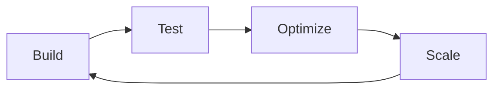

<!-- ANIMATED HEADER -->
<p align="center">
  
</p>

<!-- SPACER -->
<p align="center">
  
</p>

<!-- INTRO -->
> I build **scalable, production-ready web applications** with a focus on performance, clean architecture, and real-world usability. Not here for tutorials — I ship systems that work.

---

## 🔧 Tech Stack

<p align="center">
  
</p>

| Layer | Technologies |
|-------|-------------|
| **Design** | Figma, Adobe XD, Photoshop, Illustrator |
| **Frontend** | React, Next.js, TypeScript, Tailwind CSS |
| **Backend** | Node.js, PHP, Python, .NET |
| **Database** | MongoDB, MySQL, PostgreSQL, Firebase |
| **Cloud & DevOps** | AWS, Vercel, Docker |
| **Mobile** | Flutter |
| **Tools** | Git, VS Code |

---

## 🧩 What I Actually Do

- ⚙️ **Full-stack web apps** — frontend to backend, end-to-end
- 🔗 **API systems** — building and integrating robust backend services
- 🗄️ **Database architecture** — structured, scalable data handling
- 🎯 **Performance optimization** — speed, caching, efficient queries
- 🧱 **Modular codebases** — clean structure over clever hacks

---

## 📊 GitHub Stats

<p align="center">
  
  
</p>

<p align="center">
  
</p>

---

## 📈 Activity

<p align="center">
  
</p>

---

## 🧠 Development Principles

```
Clarity over complexity
Structure over shortcuts
Systems over hacks
```

---

## 🔄 Working Style



* Focus on **long-term maintainability**
* Prefer **simple, powerful solutions** over over-engineering
* Ship fast, iterate faster

---

## 📬 Connect

<p align="center">
  <a href="https://github.com/samuelbyalugaba">
    
  </a>
  <a href="https://linkedin.com/in/samuelbyalugaba">
    
  </a>
  <a href="https://samuelbyalugaba.com">
    
  </a>
  <a href="mailto:hi@samuelbyalugaba.com">
    
  </a>
</p>

---

<p align="center">
  
</p>

<p align="center">
  <em>Building in public. Shipping in silence.</em>
</p>
